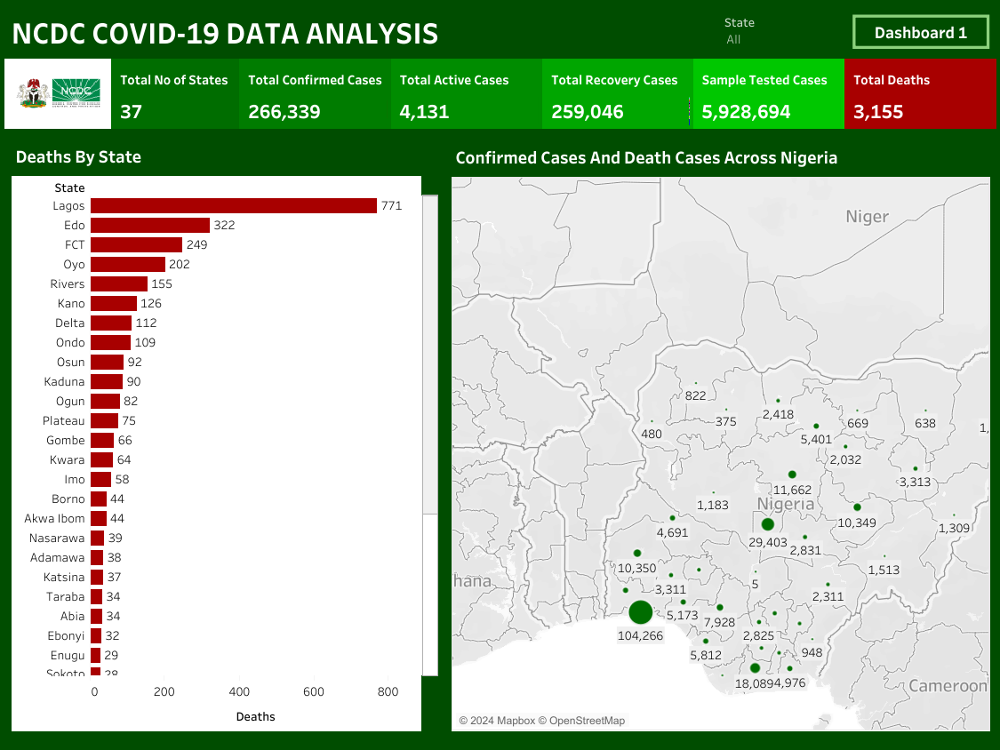

# NCDC Covid-19 Data Analysis

 

## Table of Contents
- [Project Overview](#project-overview)
- [About The Dataset](#about-the-dataset)
- [Tools Utilized](#tools-utilized)
- [Tableau Visualization](#tableau-visualization)
- [NCDC Project Analysis](#ncdc-project-analysis)
- [Tableau Visualization Dashboard](#tableau-visualization-dashboard)
- [Recommendations On Reducing The Spread of Covid-19 In Nigeria](#recommendations-on-reducing-the-spread-of-covid-19-in-nigeria)
 

## Project Overview

### Introduction:
The NCDC Covid-19 Data Analysis project aims to provide insightful analysis and visualizations based on the data collected by the Nigerias' National Center for Disease Control (NCDC) related to the Covid-19 pandemic. The project focuses on extracting meaningful insights to aid decision-making processes, public health strategies, and research initiatives.

### Objectives:
- Compilation of Covid-19 tests for individual states in Nigeria.
- To systematically collect and appraise data on the figure of reported covid-19 cases from each state in Nigeria.
- To keep the record same for all Covid-19 cases available in their states.
- Record and aggregate data on the reported number of Covid-19 recoveries per state in Nigeria.
- Keeping daily started tabulation of number of deaths from Covid-19 that each Nigerian state reported
- Interactive geospatial map that shows the distribution of confirmed Covid-19 cases and deaths across the states of Nigeria.

### Expected Outcomes:
- __Enhanced understanding of the testing terrain:__ By compiling and analyzing the data on Covid-19 tests conducted by individual states across Nigeria, the project will provide insights into the testing capacity, trends, and disparities among states.
- __Comprehensive assessment of the Covid-19 situation:__ The systematic gathering and assessment of information regarding confirmed Covid-19 cases reported by each state will enable a comprehensive understanding of the spread and severity of the pandemic across Nigeria.
- __Real-time monitoring of active cases:__ Accurate tracking and monitoring of active Covid-19 cases in each state will facilitate timely interventions and resource allocation to manage and contain the spread of the virus effectively.
- __Evaluation of recovery rates:__ Documenting and analyzing data on Covid-19 recoveries reported by individual states will enable the assessment of healthcare system effectiveness, treatment protocols, and recovery trends across Nigeria.
- __Insights into mortality patterns:__ Meticulous recording and analysis of Covid-19 related deaths reported by each state will provide insights into mortality rates, vulnerable populations, and the effectiveness of public health measures in mitigating fatalities.
- __Visual representation of spread:__ The development of an interactive geospatial map illustrating the distribution of confirmed Covid-19 cases and related deaths across states will facilitate visualization of the pandemic's geographic spread, aiding in risk assessment, decision-making, and public awareness efforts.
 

### About The Dataset
The Nigeria Centre for Disease Control and Prevention (NCDC) is the national public health institute with the mandate to lead the preparedness, detection and response to infectious disease outbreaks and public health emergencies. This organization played an active role during the peak period of the pandemic and are still actively playing that role till date. There mission is to protect the health of Nigerians through evidence-based prevention, integrated disease surveillance and response activities, using a one health approach, guided by research and led by a skilled workforce. This dataset was sourced from the NCDC general fact sheet- data as at 26th february, 2023 when it was last updated, and includes detailed information such as number of covid-19 tests carried out by states, confirmed cases by state, active cases by state, births, recoveries by state, and the pandemic death toll by state.

This dataset is made up of a single table with 9 columns and 36 rows of data representing the 36 states of Nigeria. Below is the data dictionary that describes the fields in this dataset:
| Table                    | Field                    | Description                            |            
|:------------------------ |:------------------------ |:-------------------------------------- |
|Covid-19_outbreak_in_Nigeria.csv|State                  |The name of the state within Nigeria where Covid-19 cases are reported    |
|                          |Confirmed                 |The total number of confirmed Covid-19 cases reported in the respective state since the beginning of the pandemic          |
|                          |Confirmed (Last 2 Weeks)  |The number of confirmed Covid-19 cases reported in the respective state within the last two weeks, providing a more recent snapshot of the spread        |
|                          |Recoveries                |The total number of individuals who have recovered from Covid-19 in the respective state since the beginning of the pandemic    |
|                          |Recoveries (Last 2 Weeks) |The number of individuals who have recovered from Covid-19 in the respective state within the last two weeks, indicating recent recovery trends       |
|                          |Deaths                    |The total number of deaths attributed to Covid-19 in the respective state since the beginning of the pandemic       |
|                          |Deaths (Last 2 Weeks)     |The number of deaths attributed to Covid-19 in the respective state within the last two weeks, reflecting recent mortality patterns       |
|                          |Active Cases              |The current number of active Covid-19 cases in the respective state, calculated as (Confirmed - Recoveries - Deaths) |
|                          |Testing                   |The total number of Covid-19 tests conducted in the respective state since the beginning of the pandemic, indicating testing efforts and capacity |
|                          |Testing (Last 2 Weeks)    |The number of Covid-19 tests conducted in the respective state within the last two weeks, reflecting recent testing activities and trends |
 
 

### Skills Utilized
1. Data Transformation
2. Data Visualiziation
3. Descriptive Analytics
4. Critical Thinking and Problem Solving
5. Communication and Reporting
 

### Tools Utilized
1. Microsoft Excel
    - Was used to:
        1. Was used to save extracted data from NCDC website,
        2. Transform,
        3. Load the dataset for this analysis.
     
2. Tableau (Was used to create dashboards for this analysis)
    - The following Tableau were incorporated:
        1. Calculated Fields
        2. Geospatial Analysis
        3. Page Navigation
        4. Filters
        5. Tooltips
        6. Buttons
 

### Data Transformation and Loading in Microsoft Excel and Tableau:
- Did the first data cleaning in Microsoft excel before loading the dataset to Tableau.
- Changed the data types to the appropriate data types in Tableau.
- Divided the grouped __"CONFIRMED"__ column into __"Confirmed"__ and __"Confirmed (Last 2 Weeks)"__ in Tableau.
- Divided the grouped __"RECOVERIES"__ column into __"Eecoveries"__ and __"Recoveries (Last 2 Weeks)"__ in Tableau.
- Divided the grouped __"DEATHS"__ column into __"Deaths"__ and __"Deaths (Last 2 Weeks)"__ in Tableau.
- Divided the grouped __"TESTING"__ column into __"Testing"__ and __"Testing (Last 2 Weeks)"__ in Tableau.
 

**Tableau Data View**

Tableau Data Screenshot                                                             |                                
:---------------------------------------------------------------------------------:|

 

## Join/ Blend Data
There was no need to join or blend data as we have just a single table for this analysis.
 
 

## Tableau Visualization:
#### Dashboard View 1

#### Dashboard View 2

 
 

### NCDC Project Analysis:
In this analysis, the following Key findings below were made:
- The Total Number of States for this Analysis including the state capital is __37.__
- Total Confirmed Cases within this period was __266,339.__
- The Total Active Cases was __4,131.__
- The Total Recovery Cases was __259,046.__
- Total Samples Tested Cases was __5,928,694.__
- The Total Deaths within this period was __3,155.__
 
 

- 

- **Tests Carried Out By States:**
- This analysis is on the provides information on the number of Covid-19 tests carried out by various states in Nigeria. Here's an analysis of the data along with insights i derived from it:
- __Lagos Leads in Testing:__ Lagos state has conducted the highest number of Covid-19 tests, with 1,389,728 tests carried out. This indicates the proactive approach of Lagos in testing for Covid-19, likely due to its status as a major urban center and economic hub with a high population density.
- __Significant Testing in Federal Capital Territory (FCT):__ The FCT follows closely behind Lagos with 767,808 tests conducted. As the capital city of Nigeria, FCT likely prioritizes testing to monitor and control the spread of the virus in the political and administrative center of the country.
- __Regional Disparities in Testing:__ There are notable differences in testing numbers across states. While some states like Lagos, FCT, Rivers, and Kaduna have conducted a substantial number of tests, others have significantly lower testing numbers. This suggests disparities in testing infrastructure, resources, population, and priorities among states.
- __Importance of Testing Strategy:__ States with higher testing numbers may have implemented robust testing strategies, including proactive testing, targeted testing campaigns, and widespread availability of testing facilities. These strategies are crucial for early detection, contact tracing, and containment of Covid-19 transmission.
- __Testing Challenges in Some States:__ States with lower testing numbers may face challenges such as limited access to testing facilities, inadequate testing kits and equipment, logistical constraints, or lower perceived risk of Covid-19. 
- __Need for Data-driven Decision Making:__ The data underscores the importance of data-driven decision-making in managing the Covid-19 pandemic. Accurate and timely testing data enables health authorities and policymakers to assess the extent of Covid-19 transmission, allocate resources effectively, and implement targeted interventions to control the spread of the virus.
 
 

- 

- **Confirmed Cases By State:**
- In my analysis of this data, it reveals significant disparities in the number of confirmed Covid-19 cases among various states in Nigeria. Here's a closer look at the insights i derived from the analysis:
- __Lagos' Predominance in Confirmed Cases:__ Lagos state emerges as the epicenter of Covid-19 transmission in Nigeria, with a staggering 104,266 confirmed cases. This high number can be attributed to several factors including its dense population, status as a major economic and transportation hub, and early detection efforts.
- __FCT's Considerable Burden:__ Following closely behind Lagos is the Federal Capital Territory (FCT) with 29,403 confirmed cases. Given its role as the political and administrative center of Nigeria, the FCT faces significant challenges in controlling the spread of the virus due to its high population density and frequent movement of people.
- __Notable Spread Across Multiple States:__ While Lagos and FCT account for the majority of confirmed cases, several other states including Rivers with 18,089 confirmed cases, Kaduna with 11,662 cases, Oyo with 10,350, and Plateau with 10,349 cases also report relatively high numbers of confirmed cases. This indicates widespread transmission of the virus across different regions of Nigeria.
- __Concerns Over Emerging Hotspots:__ States such as Rivers, Kaduna, and Oyo experienced increasing numbers of confirmed cases, raising concerns about the emergence of new hotspots. Swift and targeted interventions are crucial to prevent further escalation of transmission in these areas.
- __Challenges in Reporting and Surveillance:__ Discrepancies in the number of confirmed cases among states may reflect variations in testing capacity, surveillance systems, and reporting practices. Efforts to enhance testing infrastructure and improve data accuracy are essential for obtaining a more comprehensive picture of the pandemic's trajectory.
 
 

- 

- **Active Cases By State:**
- In this analysis, i provided insights into the number of active Covid-19 cases across different states in Nigeria. Here's an analysis of the active cases by state along with key insights i derived from the data:
- __Lagos Maintains Highest Active Cases:__ Lagos state continues to lead with the highest number of active Covid-19 cases, standing at 1,518. Despite ongoing efforts to control the spread, Lagos faces persistent challenges due to its large population and dense urban environment.
- __Varied Active Cases Across States:__ There is significant variation in the number of active cases among states. While Lagos has the highest count, other states like Delta has 530 active cases, Kwara has 452, and Nasarawa also report a notable number of active cases of 447. This suggests varying levels of Covid-19 transmission and containment efforts across different regions.
- __Positive Trends in Some States:__ Several states, including Zamfara, Sokoto, and Kogi, report zero active cases. This indicates positive trends in controlling the spread of the virus and potentially achieving containment in these regions. However, cautious monitoring and continued vigilance are necessary to prevent resurgence.
- __Negative Active Cases in Few States:__ Bayelsa and Edo states report negative active cases of -8 and -40 respectively, implying that the number of recoveries exceeds the number of current active cases. While this may signify successful containment efforts and recovery rates, it could also be attributed to data reporting inconsistencies or discrepancies.
 
 

- 

- **Recovery Cases By State:**
- This analysis data provides insights into the number of Covid-19 recovery cases reported across different states in Nigeria. Here's an analysis of the recovery cases by state along with key insights i derived from the data:
- __High Recovery Rates in Lagos and FCT:__ Lagos and the Federal Capital Territory (FCT) lead in the number of reported recovery cases, with Lagos recording 101,977 recoveries and FCT reporting 29,076 recoveries. This reflects the effectiveness of healthcare infrastructure, treatment protocols, and recovery efforts in these regions.
- __Consistent Recovery Trends:__ Several states, including Rivers with 17,922 recovery cases, Kaduna with 11,558, Plateau with 10,232, and Oyo with 10,135 recoveries, report significant numbers of recovery cases, indicating consistent recovery trends across different regions of Nigeria. 
- __Recovery Efforts Across States:__ Recovery cases are reported in all states, demonstrating nationwide efforts to combat the Covid-19 pandemic and provide adequate healthcare services to affected individuals. This underscores the collective response of healthcare professionals, government agencies, and communities in addressing the public health crisis.
- __Variations in Recovery Rates:__ While some states report high recovery rates, others have relatively lower numbers of recovery cases like Yobe with 625 recoveries, Kebbi with 454, Zamfara with 366 and Kogi with least recovery cases of 3 recoveries. Factors such as healthcare infrastructure, access to medical resources, and treatment protocols may influence variations in recovery rates among states.
 
 

- 

- **Death Cases By State:**
- In this analysis, insights into the number of Covid-19 related death cases reported across different states in Nigeria were provided. Here's an analysis of the death cases by state along with key insights i derived from the data:
- __High Mortality Rates in Lagos and Edo:__ Lagos and Edo states report the highest number of Covid-19 related death cases, with Lagos recording 771 deaths and Edo reporting 322 deaths. These states, as major urban centers with high population density, have experienced significant challenges in managing the impact of the pandemic on healthcare systems and mortality rates.
- __Regional Variations in Mortality:__ There are notable variations in Covid-19 related death cases among states. While some states like Lagos, Edo, and FCT with 249 death cases report relatively high mortality rates, other states like Jigawa with 18 death cases, Kebbi with 16, Zamfara with 9, Yobe with 9, and Kogi with 2, all have the lowest numbers of death cases. This reflects differences in healthcare infrastructure, access to medical resources, and response strategies across regions.
- __Impact of Healthcare Infrastructure:__ States with robust healthcare infrastructure and resources may be better equipped to manage Covid-19 cases and reduce mortality rates through timely medical interventions, intensive care, and supportive treatment. Conversely, states with limited healthcare capacity coupled with a larger population, may face higher mortality rates due to challenges in providing adequate medical care to patients.
- __Factors Influencing Mortality:__ Various factors may contribute to differences in mortality rates among states, including population demographics, prevalence of underlying health conditions, effectiveness of public health measures, and access to healthcare services. 
 
 

- 

- **Geospatial Map of Confirmed Cases and Death Cases Across Nigeria:**
- This interactive geospatial map illustrates the distribution of confirmed Covid-19 cases and related deaths across states in Nigeria. It provides valuable insights into the geographic spread of the pandemic. Here's a detailed analysis of the benefits and implications of this map:
- __Visualizing Geographic Spread:__ This geospatial map allows stakeholders to visualize the distribution of confirmed Covid-19 cases and related deaths across different states in Nigeria. By plotting data points on the map, users can quickly identify regions with high case counts and assess the extent of the pandemic's geographic spread.
- __Risk Assessment:__ The map serves as a tool for risk assessment, enabling health authorities, policymakers, and researchers to identify hotspots and emerging trends in Covid-19 transmission. Areas with high concentrations of confirmed cases and deaths may indicate heightened risk levels and the need for targeted interventions and resource allocation.
- __Decision-making Support:__ The geospatial map assists decision-making processes by providing spatial context and actionable insights into the pandemic's impact on specific regions. Decision-makers can use the map to prioritize response efforts, allocate healthcare resources, and implement containment measures based on the severity and geographic distribution of Covid-19 cases.
 
 

## Tableau Dashboard Visualization:
You can view and interact with this dashboard report [here](https://public.tableau.com/app/profile/ugo.bruno/viz/NCDCCOVID-19ANALYSIS_17041172340910/Dashboard1)
 
 
 

## Recommendations On Reducing The Spread of Covid-19 In Nigeria:
- __Public Health Education and Awareness:__ NCDC should launch extensive public health campaigns to educate the population about Covid-19 transmission modes, symptoms, and preventive measures. They should utilize various communication channels, including mass media, social media, and community outreach, to reach diverse audiences across the country.
- __Mask-Wearing Mandates and Compliance:__ NCDC should enforce mandatory mask-wearing policies in public spaces, transportation hubs, and crowded areas. THey should also ensure the availability and affordability of masks, and implement measures to encourage consistent mask-wearing behavior among the populace.
- __Enhanced Testing and Contact Tracing:__ They need to Ramp up testing capacity and accessibility to promptly identify and isolate Covid-19 cases. They can also strengthen contact tracing efforts to track and quarantine individuals who have been in close contact with confirmed cases, thereby containing the spread of the virus.
- __Vaccination Campaigns and Coverage:__ They need to carry out accelerate Covid-19 vaccination campaigns to achieve widespread immunization coverage across the population. They can address vaccine hesitancy through targeted communication strategies and community engagement initiatives.
- __Promotion of Hygiene Practices:__ The organization needs to promote frequent handwashing with soap and water or use of hand sanitizers, especially after touching surfaces in public areas. They can provide or encourage other institutions or bodies to provide adequate facilities for hand hygiene in public spaces, workplaces, and educational institutions.
- __Social Distancing Measures:__ They should implement and enforce social distancing guidelines in public settings, including maintaining a safe distance of at least one meter between individuals.They need to also limit the size of gatherings and events to reduce the risk of Covid-19 transmission in crowded environments.
- __Community Engagement and Support:__ They can engage communities in Covid-19 response efforts through participatory approaches and community-based interventions. There is a need that they provide support to vulnerable populations, including access to healthcare services, food assistance, and socio-economic relief measures to mitigate the impacts of the pandemic.
 
 

## Thank You For Following Through!
